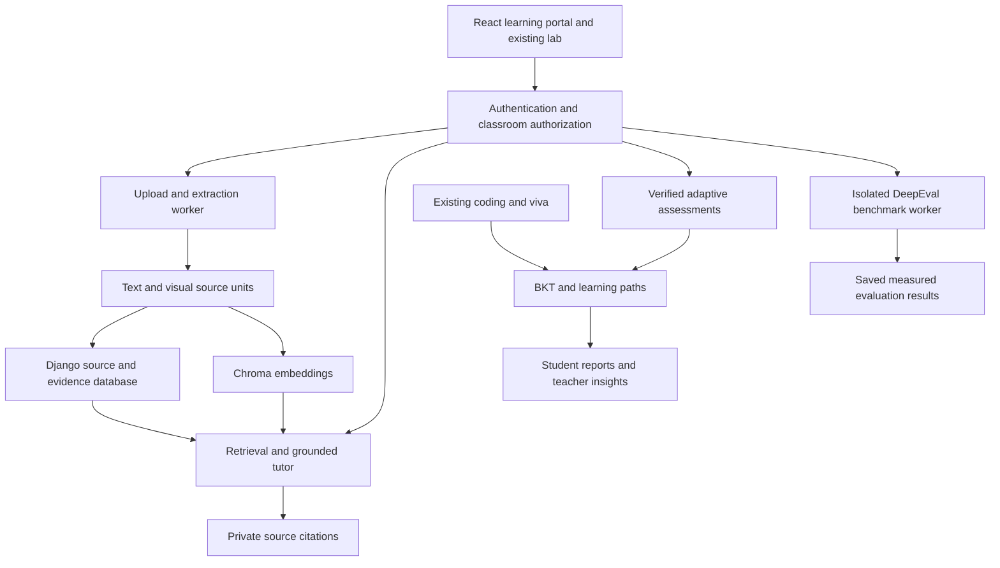

# LabTwin

**Multimodal AI Hackathon 2026 · Track D: Personalized Tutoring & Adaptive Learning**

LabTwin combines a private course knowledge base, source-grounded tutoring, verified adaptive assessments and an explainable learner model with its existing Python/C/Java programming lab.

## Problem

Students learn from disconnected lectures, textbooks and slides. A wrong program or quiz answer often produces a score without explaining the missing concept, where to revise it, or what to practice next. Teachers need evidence of those weaknesses and improvement, rather than unsupported AI judgments.

## Solution

A teacher uploads classroom materials. LabTwin extracts text and educational figures, preserves source locations, retrieves authorized evidence and tutors with clickable citations. Verified assessments and programming/viva evidence update per-topic Bayesian Knowledge Tracing (BKT). The resulting learning path, practice and teacher insights change with actual responses.

Existing authentication, join codes, syllabus analysis, execution, hidden tests, progressive hints, drafts, submission history, grading, consent-based live sharing and CSV reports remain available. See [existing lab/classroom workflows](docs/LEGACY_LAB.md). Activity signals remain evidence for teacher review; they never establish cheating or change mastery.

This release includes real, reproducible offline evaluation results and a captioned demo. Configured speech/vision services and semantic LLM judging require live-provider validation. The [compliance audit](docs/TRACK_D_COMPLIANCE_AUDIT.md) records partial requirements rather than claiming full certification.

## Track D requirement mapping

The official three-page Track D specification is the mapping baseline. The user's expanded checklist is mapped separately in the audit.

| Official requirement | LabTwin implementation | Evidence / current limit |
|---|---|---|
| 1a. Automatic videos, textbooks and slides ingestion | Private upload worker, PDF/PPTX/PPT, audio/video extraction | Real PDF/PPTX/embedded-caption video tests; uncaptained speech and legacy PPT conversion need deployment validation |
| 1b–c. Source origins, topics, concepts, prerequisites | Structured source units, boundary-preserving chunks, conservative source-evidence taxonomy | Exact pages/slides/timestamps retained; complex semantic taxonomy remains limited |
| 1d. Images, diagrams and figures | PDF vector geometry and PPTX connectors, preserved PNGs, optional image-pixel vision interpretation | Native directed diagrams tested; arbitrary raster reasoning needs a configured vision provider |
| 2a. Grounded tutoring and functional citations | Classroom-filtered Chroma/SQL retrieval, quoted support gate, private source viewer | PDF page, slide and video-seek browser checks; quote presence does not prove every paraphrase |
| 2b. Off-material handling | Explicit insufficient-material response without course citations | Six intentional off-material benchmark cases and regression tests |
| 3a. Scoped assessments | Quiz/mock/diagnostic; MCQ, short answer, numerical and existing programming practice | Topic/subtopic/module/weak-topic scopes; numerical generation bounded by source-supported examples |
| 3b. Correctness and novelty | Deterministic source verification, independent-model gate, private keys, per-student novelty/history | Verified templates executed; lexical duplicate approximation offline, neural comparison when ONNX is configured |
| 3c. Cited feedback and reports | Explanation, misconception, revision sources, mastery impact, saved assessment report | Open-ended grading can await authorized teacher review |
| 4a. Formal learner model | BKT with documented assistance/reliability extension and retained evidence/snapshots | Quiz, programming, hidden tests, hints, retries, viva and checked conversations; parameters not population-fitted |
| 4b. Cold start | Unknown/Not Started state plus source-backed diagnostic | Actual diagnostic answers produce different estimates |
| 5a–b. Framework and RAG evaluation | DeepEval 4.2.7 runs a 20-case original gold dataset | Four measured offline proxy metrics; standard semantic metrics available but not live-executed here |
| 5c. Multi-session personalization evaluation | Three profiles, diagnostics and four sessions each | Actual selection/grading/BKT/recommendations, Brier loss and repetition; controlled simulation, not a human learning study |

For every official item, expanded requirement, route, UI, test and limitation, see [Track D compliance audit](docs/TRACK_D_COMPLIANCE_AUDIT.md). See [judging evidence](docs/JUDGING_EVIDENCE.md) for the six weighted categories; no predicted judge score is assigned.

## Architecture

The Django backend and React/Vite frontend are extended, not rebuilt. New services live in `backend/labtwin/learning/`; the original code execution, authentication, classroom and assessment modules remain in use.



| Concern | Main modules |
|---|---|
| Authentication/classrooms | `access.py`, `classroom_views.py`, `assessment_views.py`, `live_views.py` |
| Upload/extraction | `learning/processing.py`, `workers.py`, `ingestion.py`, `extraction.py`, `transcription.py`, `visuals.py`, `taxonomy.py` |
| Chunking/embedding/retrieval | `ingestion.py`, `vectors.py` |
| Grounding/citations/media | `rag.py`, `sources.py`, `media.py` |
| Assessment/verification/novelty | `assessments.py`, `practice.py`, `question_generation.py`, `question_verification.py`, `novelty.py` |
| Learner/personalization | `learner_model.py`, `mastery.py`, `coaching.py`, `viva.py` |
| Analytics/evaluation | `insights.py`, `evaluation.py`, `scripts/run_benchmarks.py`, `scripts/evaluate_metrics.py` |

Migrations `0007_final_track_d`, `0008_assessment_camera` and `0009_material_processing_progress` add fields/models without deleting existing records. Historical material units survive reprocessing so previously saved citations retain their location. Reindexing selects active units only. Existing course scores keep their legacy model label until evidence is explicitly replayed; global lab readiness is preserved.

## Multimodal pipeline

Upload → validate → extract text and figures → source-evidence topic/concept mapping → boundary-preserving chunks → embeddings → authorized retrieval → source-grounded answer → private citations.

- **PDF:** per-page text/headings and rendered page figures; native boxes/arrows become a labelled relationship graph. Scanned text can use OCR. Vision interpretation receives actual page pixels when configured.
- **PPTX:** titles, text, tables, notes, images and native connector relationships; reconstructed slide/figure viewer preserves slide number. `.ppt` uses LibreOffice conversion automatically.
- **Lecture:** embedded subtitles are extracted automatically when present; otherwise ffmpeg/Groq Whisper produce timestamped segments. Chapters, key topics, summaries, transcript search and timestamp seeking are available. Video visual extraction currently uses bounded frame OCR.
- Every source unit retains material ID, filename/type, classroom/course, page/slide/time, topic/subtopic/concepts/prerequisites, visual representation/method and embedding reference.

The demo's video already contains embedded captions. It demonstrates automatic caption extraction, not a successful speech-provider call. OCR alone is not described as diagram understanding. Native diagram reasoning is used in retrieval and in a verified numerical question.

## Optional assessment camera

Students can explicitly enable a private camera preview and on-device reminders during diagnostics, quizzes and mock exams. Sustained head-position/face-visibility cues can offer a source-linked own-words check, with optional eyes-closed instructions only when teacher and student both choose them. Camera cues are fallible review observations; they never establish copying or understanding and never affect grades or mastery. The existing assignment/viva live sharing also supports optional local reminders. See [camera setup, privacy, controls and tests](docs/ASSESSMENT_CAMERA.md).

## Learner model

Course mastery uses **Bayesian Knowledge Tracing**, with latent known/unknown state and parameters prior `0.35`, learning `0.08`, guess `0.15`, slip `0.10`. MCQ guessing uses `1 / option_count`. Per-topic overrides are validated probabilities.

For correctness fraction `f` and reliability `r`, the known likelihood is `((1-slip)^f × slip^(1-f))^r`; unknown likelihood is `(guess^f × (1-guess)^(1-f))^r`. Bayes updates the prior, then learning adds `(1-posterior) × learning × r`. All retained scored evidence is replayed chronologically; evidence keys prevent duplicate observations.

Reliability is `[1, .85, .65, .45]` for hint levels 0–3, multiplied by `max(.35, .9^(attempt-1))` and by `.4` for provisional/unverified evidence. This is a documented extension for partial grades, repeated attempts and assisted answers, not a fitted psychological model. Parameters and likelihood assumptions need calibration with real students.

Current BKT parameters are prototype parameters and have not been population-calibrated. Future calibrated parameters can use the existing per-topic `CourseTopic.learner_parameters` configuration; no BKT equations were changed by the hardening work. Simulated learner evaluations are not real human studies.

Opening a resource or asking a question records engagement without increasing knowledge. A verified **Check my understanding** question makes a conversation observable assessment evidence. Cold-start students see Not Started and a diagnostic offer. Strong ≥80, Developing ≥50, Needs Practice <50; without scored observations, Not Started.

Tutor guidance changes between foundation, guided and advanced styles. Practice checks weak prerequisites, recent mistakes and available verified difficulty. “Why am I getting this question?” uses actual evidence and source recommendations. Source-supported question scarcity is disclosed rather than relabelling an easy question as difficult.

For an existing database, optionally run `python manage.py rebuild_mastery --course COURSE_ID` after backup and migration. It preserves every original evidence row and snapshot, appends a labelled model-transition snapshot, and does not count a model transition as learning improvement.

## Assessment pipeline

Scope selection → mastery/prerequisite targeting → grounded generation or teacher bank → correctness/source/difficulty gate → novelty check → delivery → cited grading/feedback → BKT update → saved report.

Verified offline templates cover source quotation MCQs, source-definition short answers, worked arithmetic and native diagram node counts. AI candidates cannot approve themselves: an independently configured verifier must pass them. Teacher-authored banks retain their separate `teacher_reviewed` label and existing functionality.

Server-only keys, rubrics and hidden tests are never in student question payloads. Exact/factual short answers and numerical tolerance/unit checks are deterministic. Open responses that cannot be judged objectively wait for teacher review rather than receiving a fabricated correct/incorrect verdict. Exhausted verified/nonrepeating pools return a useful error.

## Evaluation

[Evaluation guide](evaluation/README.md) defines each metric, dataset and experiment. [Saved baseline JSON](evaluation/results/baseline.json) contains actual pipeline/framework outputs, cases, citations, source/dataset hashes, timestamp, learner histories and limitations.

DeepEval runs in a **separate virtual environment** because its PostHog dependency conflicts with the existing Chroma/CrewAI stack. Application dependencies are preserved.

Offline results are explicitly labelled deterministic proxies: supporting-quote presence, reference-concept coverage, gold-location average precision and gold-location recall. They are not semantic entailment scores. Optional LLM mode executes DeepEval's standard semantic Faithfulness, Answer Relevancy, Contextual Precision and Contextual Recall metrics with a configured Groq judge; it requires credentials and has not been live-validated in this workspace. Failure saves an error without replacement scores.

Three simulated learner profiles complete diagnostics and four sessions. The experiment measures mastery before/after, next-answer Brier loss against a static-prior baseline, evidence counts, uncertainty, selected difficulty, recommendations and repeated-question rate. Controlled improving responses demonstrate model adaptation, not causal improvement in human learning.

## Installation

Use **Python 3.12+**, **Node 22+** and npm. On Debian/Ubuntu install native tools:

```bash
sudo apt-get update
sudo apt-get install -y build-essential default-jdk-headless ffmpeg poppler-utils tesseract-ocr libreoffice-impress fonts-dejavu-core
```

From this project directory:

```bash
python -m venv .venv
. .venv/bin/activate
python -m pip install --upgrade pip
python -m pip install -r requirements-render.txt
python -m venv .venv-evaluation
.venv-evaluation/bin/python -m pip install -r requirements-evaluation.txt
cp .env.example .env
```

Edit `.env`: set `DJANGO_SECRET_KEY`, the exact `FRONTEND_URL` and an **absolute** `LABTWIN_EVALUATOR_PYTHON` pointing to `.venv-evaluation/bin/python`. Configure your own `GROQ_API_KEY` for AI/speech, a currently supported vision model for arbitrary raster figures, and a separate verifier/judge model where needed. Credentials stay out of git.

Scanned PDF notes require **Tesseract on PATH** for local OCR; searchable PDFs use native text extraction. PDF rendering uses PyMuPDF, so Poppler is no longer required for scanned PDF processing. On Windows, activate `.venv\Scripts\Activate.ps1`, install the same Python requirements, and ensure Tesseract, ffmpeg, GCC and the JDK tools needed for your course are on PATH. Verify `tesseract --version`, `ffmpeg -version`, `gcc --version` and `javac -version`. LibreOffice is required only for legacy `.ppt` conversion. A missing OCR tool now produces a retryable error rather than empty extracted notes.

The Chroma ONNX MiniLM embedding model downloads on first use. Warm its cache before a live demo, or explicitly choose `LABTWIN_EMBEDDING_BACKEND=hash` for offline reproducibility. Hash mode is lexical feature hashing, not neural semantic understanding. Never change an existing vector directory's Chroma format in place; retain a backup, choose a new directory and run `reindex_materials`.

## Dependencies

| Runtime | Dependencies / purpose |
|---|---|
| Application Python | Django 6, CORS, CrewAI 1.15.14, Groq, Pydantic 2.12.5, LiteLLM, python-dotenv, Gunicorn |
| Knowledge base | Chroma 1.1.1, NumPy, tokenizers/ONNX embedding dependencies, pypdf, PyMuPDF, python-pptx, ReportLab |
| Isolated evaluator | DeepEval 4.2.7 and Groq; installed from `requirements-evaluation.txt` |
| Frontend | React 19, Vite 8, Axios, MediaPipe tasks-vision 1.0.1 and packages locked in `frontend/package-lock.json` |
| Native extraction/execution | ffmpeg/ffprobe, Poppler, Tesseract, LibreOffice Impress, GCC and JDK |
| Browser verification | Optional Playwright/Chromium; not a production dependency |

The Dockerfile installs the separate evaluation environment and native dependencies; a Docker build was not executed in this workspace. Deploy web, material worker and evaluation worker against the same persistent database and private volumes.

## Environment variables

Copy [.env.example](.env.example). Main variables:

| Variable | Purpose |
|---|---|
| `GROQ_API_KEY`, `DJANGO_SECRET_KEY`, `FRONTEND_URL` | Provider credentials, Django signing, allowed frontend origin |
| `LABTWIN_TUTOR_MODEL`, `LABTWIN_TRANSCRIPTION_MODEL` | Grounded tutor and timestamped speech model |
| `LABTWIN_LEGACY_AI_TIMEOUT_SECONDS` | Original programming AI provider-call deadline; default 45 seconds, bounded to 5–120. Existing rate-limit retries remain bounded; implicit LiteLLM retries are disabled |
| `LABTWIN_VISION_MODEL`, `LABTWIN_VERIFIER_MODEL` | Optional actual-pixel figure interpretation and independent question verification |
| `LABTWIN_EVALUATOR_PYTHON`, `LABTWIN_EVALUATION_JUDGE_MODEL` | Separate DeepEval interpreter and optional semantic judge |
| `LABTWIN_EMBEDDING_BACKEND` | `onnx` for neural retrieval or explicit offline `hash` |
| `LABTWIN_MEDIA_ROOT`, `LABTWIN_VECTOR_ROOT` | Persistent private uploads and vector index |
| `LABTWIN_PROCESS_INLINE`, `LABTWIN_DEMO_ENABLED` | Trusted small-demo synchronous processing and teacher Demo Mode |
| `LABTWIN_PROCESS_MODE`, `LABTWIN_MATERIAL_TIMEOUT_SECONDS` | `local` automatically dispatches bounded background jobs; `external` uses dedicated workers. Material deadline defaults to 600 seconds |
| `LABTWIN_UPLOAD_MAX_BYTES`, `LABTWIN_MEDIA_MAX_SECONDS`, `LABTWIN_MAX_VISUAL_UNITS`, `LABTWIN_VIDEO_OCR` | Extraction limits and bounded video OCR |
| `LABTWIN_RUNNER_URL`, `LABTWIN_RUNNER_SECRET` | Optional isolated execution worker; see `executor/README.md` |
| `WEBRTC_ICE_SERVERS` | Deployment STUN/TURN configuration for existing consent-based sharing |

## Running LabTwin

For an optional private Linux/HTTPS browser acceptance deployment of this
existing application, see [deployment instructions](deployment/README.md).
It uses the current requirements, migrations and UI; the old Intel Mac only
needs a web browser. Hosted deployment and camera checks must be measured on
the actual service before declaring demo readiness.

Back up the existing SQLite database, private uploads, vector index and `student_sessions/` before upgrading. Do not replace them with demo files.

```bash
cd backend
python manage.py migrate
python manage.py check
python manage.py runserver
```

Local development defaults to `LABTWIN_PROCESS_MODE=local` and `LABTWIN_PROCESS_INLINE=false`. Uploads start automatically after the database transaction commits; no extra worker terminal is needed. The materials page shows actual extraction, OCR, indexing and summary stages with page/slide/chunk counts when known. Queued uploads resume when the authorized teacher opens that page. Interrupted jobs retain their original file and become retryable after their deadline. Increase `LABTWIN_MATERIAL_TIMEOUT_SECONDS` for very large scanned textbooks.

For hosting, explicitly set `LABTWIN_PROCESS_MODE=external` and run both dedicated workers against the same persistent database and private directories. From `backend`, in two separate worker processes:

```bash
python manage.py process_materials --watch
```

```bash
python manage.py process_evaluations --watch
```

When upgrading a server with notes stuck at Processing, back up its data, install requirements, run `python manage.py migrate`, and restart the server/workers. Open Course Materials and use **Retry processing** for failed uploads or **Resume** for queued uploads. An active job cannot be retried while it still owns a valid lease. Its default maximum processing time is ten minutes plus a 30-second recovery grace period; original files and old citations are retained.

From `frontend`:

```bash
npm ci
npm run dev
```

Open `http://localhost:5173`; API is `http://127.0.0.1:8000`. Student navigation includes Dashboard, Ask LabTwin, My Courses, Learning Path, Practice, Assignments, Assessments, Viva, Mastery Map and Progress. Teachers have Dashboard, Classes, Course Materials, Assignments, Students, Assessments, AI Insights, Reports, Evaluation and Demo Mode.

The original syllabus/code workflow remains under **Practice → Programming lab · existing workflow**. Navigating retains its mounted state and the visible Stop All control for active consent-based sharing.

## Demo

See [the 17-step demo guide](docs/DEMO_GUIDE.md). A teacher selects **Demo Mode → Prepare guided demo**. It processes three original fixtures and opens an isolated enrolled demo learner, leaving real student data alone. Follow cited tutoring, off-material handling, verified assessment, real failing C code, hints, successful retry, BKT update, explained follow-up and teacher evidence. Run Evaluation to display newly measured results.

[Captioned demonstration](docs/demo/labtwin-track-d-demo.mp4) and [English subtitles](docs/demo/labtwin-track-d-demo.srt) accompany this release. The demo is a real local browser recording; the test server stubs the old remote CrewAI handlers, while the new offline tutor, auth, retrieval, code runners, assessment and evaluation are executed. YouTube/Devpost publication is still an external submission step.

## Password recovery

The existing login includes **Forgot password?** with registered-email recovery,
eight-digit email OTPs (10-minute expiry, five attempts), optional 30-minute
single-use reset links and existing-session revocation. Roles and learning
records retain their identities. Email sending requires your encrypted SMTP
credentials and verified sender; it is disabled by default and has no public
reset-link fallback. Legacy accounts without a saved email require verified
administrator assistance. See [password recovery setup and tests](docs/PASSWORD_RECOVERY.md),
including the current Free Render storage/SMTP constraints.

## Testing

With both environments installed, from the project root:

```bash
export LABTWIN_TEST_EVALUATOR_PYTHON="$PWD/.venv-evaluation/bin/python"
cd backend
python manage.py test labtwin --settings=backend.test_settings
python manage.py check
python manage.py makemigrations --check --dry-run
```

From the project root, also run `python scripts/check_background_uploads.py`. It uses a disposable persistent database and the normal application routes to exercise real child-process PDF/PPTX/video ingestion, scanned PDF OCR, corrupted upload handling, source isolation, citations, programming/hints/retry, mastery, adaptive follow-up, viva and reports. With `LABTWIN_TEST_EVALUATOR_PYTHON` set, it additionally executes a real background DeepEval run. It explicitly uses offline hash embeddings and disables remote AI; it does not claim provider quality. Tesseract, ffmpeg and GCC are required for this integration check.

From `frontend`: `npm run test:camera`, `npm run test:api`, `npm run build` and `npm run lint`. The API checks load the actual Vite modules in SSR mode; they do not certify browser rendering or camera hardware. The predev/prebuild script prepares self-hosted camera WASM assets; the official Face Landmarker model is bundled. Browser checks are documented in [demo guide](docs/DEMO_GUIDE.md); they use a disposable local database, not production data. No failing tests are disabled. [Validation record](docs/VALIDATION.md) records the release checks and environment limits.

To include a real PDF, all three language runners, and saved measured evidence in the disposable integration check:

```bash
LABTWIN_TEST_EVALUATOR_PYTHON="$PWD/.venv-evaluation/bin/python" \
  .venv/bin/python scripts/check_background_uploads.py \
  --record-pdf '/path/to/Record(1).pdf' --all-languages \
  --results /path/to/acceptance-results.json
```

This verifies API source access and original file bytes, not actual citation clicks. Use a full JDK (`javac` and `java`) for Java. The JSON records actual saved evaluation results, controlled learner evidence, and execution outcomes; it contains no production student data.

The current practical acceptance status and outstanding real-browser checks are recorded in [LabTwin-Final-Hardening-Acceptance.md](LabTwin-Final-Hardening-Acceptance.md).

## Recoverable failure behaviour

Native PDF text is tried first. Image-heavy pages containing only short headers also require OCR. Missing/failed required OCR terminates with a retained upload and setup guidance; it never marks headers alone as sufficient teaching content. Optional figure OCR failures keep native text, image pixels and source locations, with warnings. Unanalysed raster images are preserved without invented searchable descriptions. Configured vision failures retain native geometry/OCR provenance and display a warning.

Lecture ingestion prefers reliable embedded captions before speech transcription. ffmpeg, OCR, vision, transcription and tutoring calls have finite deadlines; extraction jobs also have a hard deadline and recoverable leases. Groq calls use at most one SDK retry. Missing speech configuration or transcription failure produces a retryable failed upload, retaining the original media. There is no silent provider switch.

The frontend API client returns control after 120 seconds. A client timeout cannot cancel server work: refresh to inspect the saved state before repeating an upload, assessment submission or other mutation. Legacy AI errors return safe messages and log exception types instead of private provider responses. No answer keys, hidden tests, raw camera frames or misconduct judgments are added by these changes.

## Security and limitations

All course retrieval, source/media access, learner history, reviews, insight drill-down and evaluation runs enforce classroom/account authorization. Five-minute signed source URLs remain bound to an active token and current enrollment, including byte-range requests. Logout or classroom removal revokes access. Hidden tests and keys remain server-side.

The compatibility runner executes code on the host; use the supplied isolated worker before accepting untrusted public code. Use HTTPS, persistent private storage and a proper deployment secret. Camera/screen sharing is consent-based WebRTC; no gaze analysis, automatic cheating accusation or recorded surveillance is added.

Broad raster-diagram semantics, speech transcription, neural retrieval, independent semantic verification and LLM-judge evaluation need live-model/cache validation. Native diagrams, embedded captions, hash retrieval and deterministic verification/evaluation are the executed release path. Slides are reconstructed rather than pixel-perfect PowerPoint renderings; visual/video sampling has limits. Numericals require supported source data. Duplicate detection is approximate. BKT parameters and difficulty are not calibrated to a student population.

Optional generated flashcards/audio briefs, exam-date schedules and multilingual/audio tutoring are not implemented. The complete upgraded project is published at [fjprojects/LabTwin-Track-D-2026](https://github.com/fjprojects/LabTwin-Track-D-2026); all 193 source/assets were verified by path, size and Git blob hash. YouTube/Devpost submission remains pending. See the audit for the complete gap list and [current functionality checkpoint](docs/FUNCTIONAL_CHECKPOINT.md) for the PDF repair and remaining deployment checks.

## Team and repository

The existing README names are retained: **Fancis, Jomon JoJo, Parvathy**. Full verified names and all Devpost memberships must be supplied before submission.

Existing repository: https://github.com/fjprojects/projects/tree/main/LabTwin-AI
